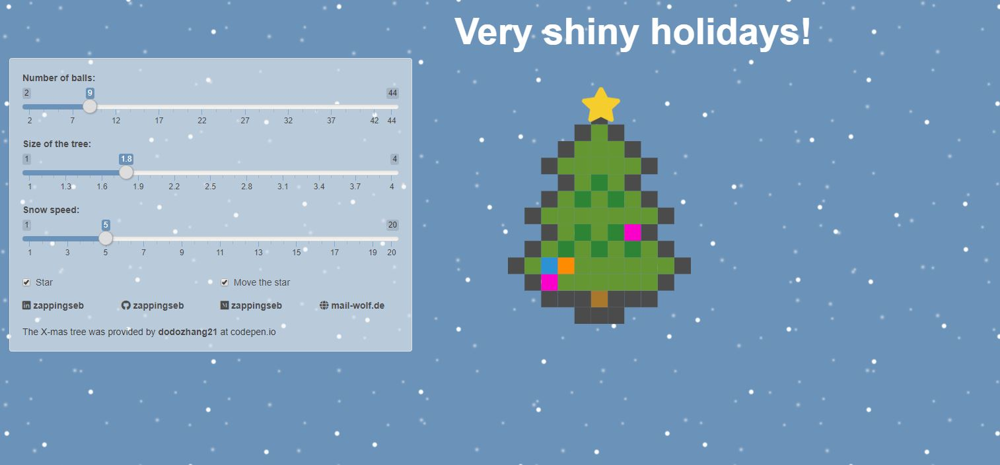

# Very shiny holidays

You always wanted to send holiday cards with R shiny? No. Me neither, but I thought it's a kind of nerdy way to send best wishes for the holidays. Now they are not only best wishes, but **shiny** wishes. Introducing shinyxmas, an app to play with shiny, CSS, jQuery and R to let Christmas come right into your repo. 

This is a R-shiny app based on a Codepen by [dodozhang21](https://codepen.io/dodozhang21/pen/imIvg) that builds a
Christmas tree with a slider for the size, number of balls on the tree. Behind the app there is snow falling,
such that the user will be able to select the speed of the snow.

You can run the app by simply using:

```
install.packages(c("dplyr","magrittr","stringr","shiny","shinyjs","glue"))
shiny::runApp()
```

Very shiny holidays


